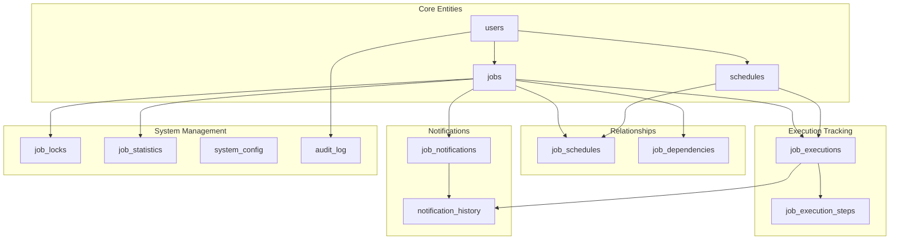
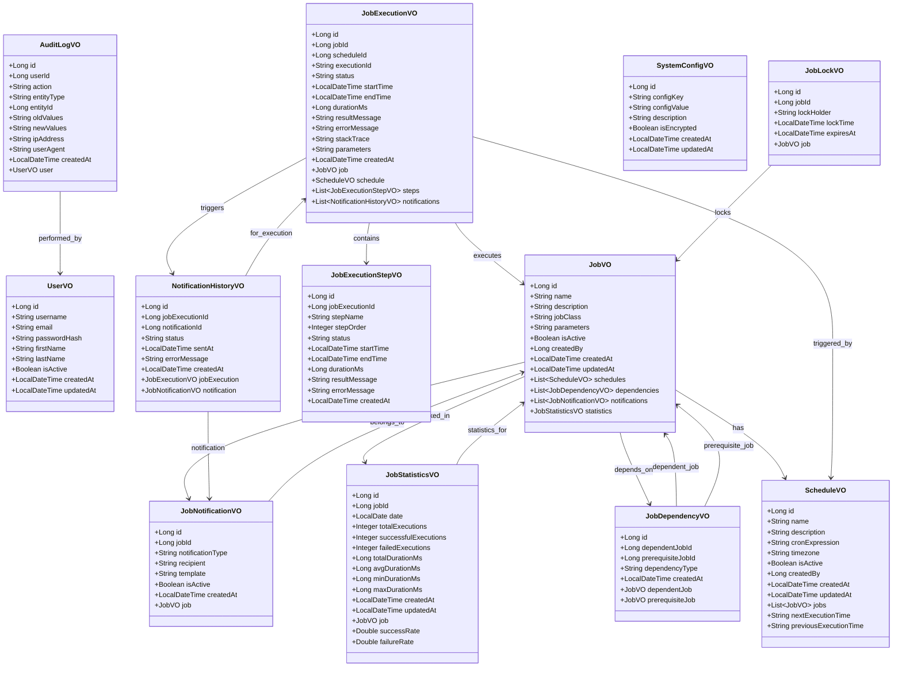
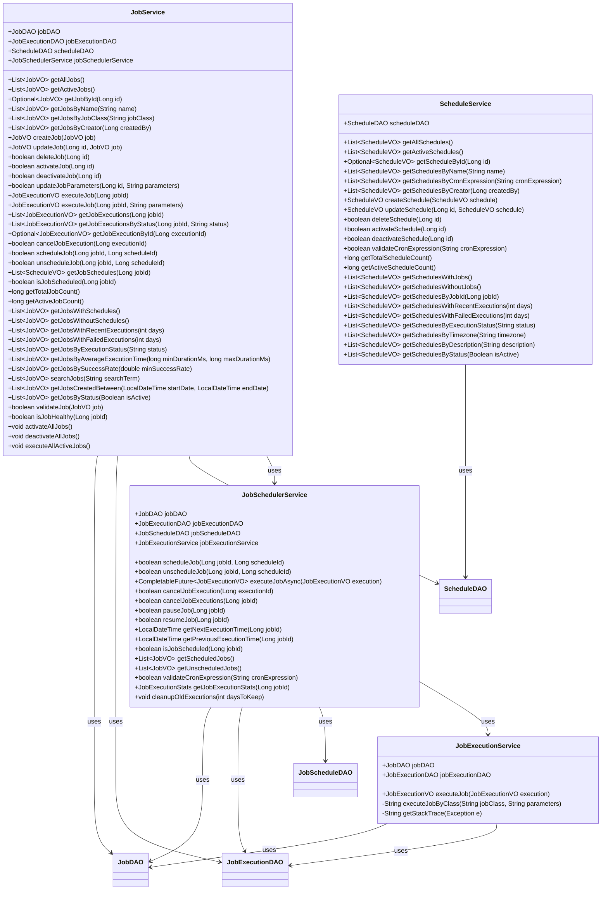
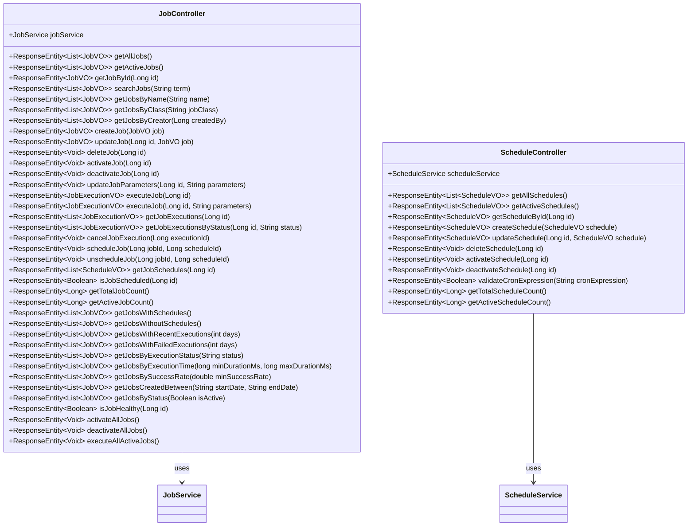
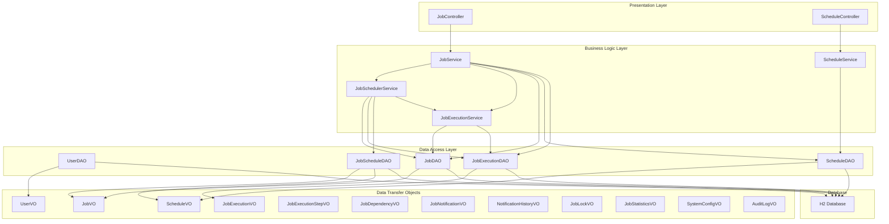

# Job Scheduling API

A comprehensive Spring Boot application for managing and scheduling jobs with advanced features including job dependencies, notifications, statistics, and monitoring.

## 🚀 Features

### Core Functionality
- **Job Management**: Create, update, delete, and manage jobs with parameters
- **Schedule Management**: Define cron-based schedules with timezone support
- **Job Execution**: Execute jobs manually or automatically based on schedules
- **Job Dependencies**: Define blocking and non-blocking job dependencies
- **Notifications**: Email, SMS, Webhook, and Slack notifications
- **Statistics & Analytics**: Performance monitoring and execution statistics
- **Audit Logging**: Complete audit trail for all operations
- **User Management**: User authentication and authorization

### Advanced Features
- **Concurrent Execution Prevention**: Job locks to prevent duplicate executions
- **Step-by-Step Execution**: Track complex jobs with multiple steps
- **Health Monitoring**: Job health checks and status monitoring
- **Bulk Operations**: Activate/deactivate/execute multiple jobs
- **Search & Filtering**: Advanced search and filtering capabilities
- **Performance Analytics**: Execution time analysis and success rates

## 🏗️ Architecture

### Database Schema
The application uses a comprehensive database schema with the following tables:

1. **users** - User management and authentication
2. **jobs** - Job definitions with parameters
3. **schedules** - Cron-based schedule definitions
4. **job_schedules** - Many-to-many relationship between jobs and schedules
5. **job_executions** - Execution history and status tracking
6. **job_execution_steps** - Step-by-step execution tracking
7. **job_dependencies** - Job dependency management
8. **job_notifications** - Notification configuration
9. **notification_history** - Notification delivery tracking
10. **job_locks** - Concurrent execution prevention
11. **job_statistics** - Performance monitoring and analytics
12. **system_config** - Application configuration storage
13. **audit_log** - Complete audit trail

### Entity Relationship (ER) Diagram

```mermaid
erDiagram
    users {
        bigint id PK
        varchar username UK
        varchar email UK
        varchar password_hash
        varchar first_name
        varchar last_name
        boolean is_active
        timestamp created_at
        timestamp updated_at
    }

    jobs {
        bigint id PK
        varchar name
        text description
        varchar job_class
        text parameters
        boolean is_active
        bigint created_by FK
        timestamp created_at
        timestamp updated_at
    }

    schedules {
        bigint id PK
        varchar name
        text description
        varchar cron_expression
        varchar timezone
        boolean is_active
        bigint created_by FK
        timestamp created_at
        timestamp updated_at
    }

    job_schedules {
        bigint id PK
        bigint job_id FK
        bigint schedule_id FK
        boolean is_active
        timestamp created_at
    }

    job_executions {
        bigint id PK
        bigint job_id FK
        bigint schedule_id FK
        varchar execution_id UK
        enum status
        timestamp start_time
        timestamp end_time
        bigint duration_ms
        text result_message
        text error_message
        text stack_trace
        text parameters
        timestamp created_at
    }

    job_execution_steps {
        bigint id PK
        bigint job_execution_id FK
        varchar step_name
        int step_order
        enum status
        timestamp start_time
        timestamp end_time
        bigint duration_ms
        text result_message
        text error_message
        timestamp created_at
    }

    job_dependencies {
        bigint id PK
        bigint dependent_job_id FK
        bigint prerequisite_job_id FK
        enum dependency_type
        timestamp created_at
    }

    job_notifications {
        bigint id PK
        bigint job_id FK
        enum notification_type
        varchar recipient
        varchar template
        boolean is_active
        timestamp created_at
    }

    notification_history {
        bigint id PK
        bigint job_execution_id FK
        bigint notification_id FK
        enum status
        timestamp sent_at
        text error_message
        timestamp created_at
    }

    job_locks {
        bigint id PK
        bigint job_id FK UK
        varchar lock_holder
        timestamp lock_time
        timestamp expires_at
    }

    job_statistics {
        bigint id PK
        bigint job_id FK
        date date
        int total_executions
        int successful_executions
        int failed_executions
        bigint total_duration_ms
        bigint avg_duration_ms
        bigint min_duration_ms
        bigint max_duration_ms
        timestamp created_at
        timestamp updated_at
    }

    system_config {
        bigint id PK
        varchar config_key UK
        text config_value
        text description
        boolean is_encrypted
        timestamp created_at
        timestamp updated_at
    }

    audit_log {
        bigint id PK
        bigint user_id FK
        varchar action
        varchar entity_type
        bigint entity_id
        text old_values
        text new_values
        varchar ip_address
        text user_agent
        timestamp created_at
    }

    %% Relationships
    users ||--o{ jobs : "creates"
    users ||--o{ schedules : "creates"
    users ||--o{ audit_log : "performs"
    
    jobs ||--o{ job_schedules : "has"
    schedules ||--o{ job_schedules : "assigned_to"
    
    jobs ||--o{ job_executions : "executes"
    schedules ||--o{ job_executions : "triggers"
    
    job_executions ||--o{ job_execution_steps : "contains"
    
    jobs ||--o{ job_dependencies : "depends_on"
    jobs ||--o{ job_dependencies : "prerequisite_for"
    
    jobs ||--o{ job_notifications : "notifies"
    
    job_executions ||--o{ notification_history : "triggers"
    job_notifications ||--o{ notification_history : "sent"
    
    jobs ||--o{ job_locks : "locked_by"
    
    jobs ||--o{ job_statistics : "tracked_in"
```

### Database Schema Overview



### Application Layers

#### Value Objects (VO)
- `UserVO`, `JobVO`, `ScheduleVO`, `JobExecutionVO`, etc.
- Data transfer objects with Lombok annotations
- Include convenience fields for related entities

#### Data Access Objects (DAO)
- `UserDAO`, `JobDAO`, `ScheduleDAO`, `JobExecutionDAO`, etc.
- Comprehensive database operations using Spring JDBC
- Row mappers for efficient data mapping
- Advanced query methods for filtering and analytics

#### Service Layer
- `JobService`, `ScheduleService`, `JobSchedulerService`, etc.
- Business logic implementation
- Transaction management
- Validation and error handling

#### Controller Layer
- `JobController`, `ScheduleController`, etc.
- RESTful API endpoints
- Comprehensive CRUD operations
- Advanced filtering and search endpoints

### Class Diagrams

#### Value Objects (VO) Layer



#### Data Access Layer (DAO)

```mermaid
classDiagram
    class UserDAO {
        +JdbcTemplate jdbcTemplate
        +RowMapper~UserVO~ userRowMapper
        +List~UserVO~ findAll()
        +List~UserVO~ findActiveUsers()
        +Optional~UserVO~ findById(Long id)
        +Optional~UserVO~ findByUsername(String username)
        +Optional~UserVO~ findByEmail(String email)
        +List~UserVO~ findByFirstName(String firstName)
        +List~UserVO~ findByLastName(String lastName)
        +UserVO save(UserVO user)
        +boolean deleteById(Long id)
        +boolean deactivateUser(Long id)
        +boolean activateUser(Long id)
        +boolean updatePassword(Long id, String newPasswordHash)
        +boolean existsByUsername(String username)
        +boolean existsByEmail(String email)
        +long count()
        +long countActiveUsers()
    }

    class JobDAO {
        +JdbcTemplate jdbcTemplate
        +RowMapper~JobVO~ jobRowMapper
        +List~JobVO~ findAll()
        +List~JobVO~ findActiveJobs()
        +Optional~JobVO~ findById(Long id)
        +List~JobVO~ findByName(String name)
        +List~JobVO~ findByJobClass(String jobClass)
        +List~JobVO~ findByCreatedBy(Long createdBy)
        +List~JobVO~ findByStatus(Boolean isActive)
        +JobVO save(JobVO job)
        +boolean deleteById(Long id)
        +boolean deactivateJob(Long id)
        +boolean activateJob(Long id)
        +boolean updateParameters(Long id, String parameters)
        +boolean existsByName(String name)
        +boolean existsByJobClass(String jobClass)
        +long count()
        +long countActiveJobs()
        +List~JobVO~ findJobsWithSchedules()
        +List~JobVO~ findJobsWithoutSchedules()
        +List~JobVO~ findJobsByDependencyType(String dependencyType)
        +List~JobVO~ findJobsWithNotifications()
        +List~JobVO~ findJobsByNotificationType(String notificationType)
        +List~JobVO~ findJobsWithRecentExecutions(int days)
        +List~JobVO~ findJobsWithFailedExecutions(int days)
        +List~JobVO~ findJobsByExecutionStatus(String status)
        +List~JobVO~ findJobsByAverageExecutionTime(long minDurationMs, long maxDurationMs)
        +List~JobVO~ findJobsBySuccessRate(double minSuccessRate)
    }

    class ScheduleDAO {
        +JdbcTemplate jdbcTemplate
        +RowMapper~ScheduleVO~ scheduleRowMapper
        +List~ScheduleVO~ findAll()
        +List~ScheduleVO~ findActiveSchedules()
        +Optional~ScheduleVO~ findById(Long id)
        +List~ScheduleVO~ findByName(String name)
        +List~ScheduleVO~ findByCronExpression(String cronExpression)
        +List~ScheduleVO~ findByCreatedBy(Long createdBy)
        +List~ScheduleVO~ findByStatus(Boolean isActive)
        +ScheduleVO save(ScheduleVO schedule)
        +boolean deleteById(Long id)
        +boolean deactivateSchedule(Long id)
        +boolean activateSchedule(Long id)
        +boolean existsByName(String name)
        +long count()
        +long countActiveSchedules()
        +List~ScheduleVO~ findSchedulesWithJobs()
        +List~ScheduleVO~ findSchedulesWithoutJobs()
        +List~ScheduleVO~ findByJobId(Long jobId)
        +List~ScheduleVO~ findSchedulesWithRecentExecutions(int days)
        +List~ScheduleVO~ findSchedulesWithFailedExecutions(int days)
        +List~ScheduleVO~ findSchedulesByExecutionStatus(String status)
        +boolean validateCronExpression(String cronExpression)
    }

    class JobExecutionDAO {
        +JdbcTemplate jdbcTemplate
        +RowMapper~JobExecutionVO~ executionRowMapper
        +List~JobExecutionVO~ findAll()
        +Optional~JobExecutionVO~ findById(Long id)
        +Optional~JobExecutionVO~ findByExecutionId(String executionId)
        +List~JobExecutionVO~ findByJobId(Long jobId)
        +List~JobExecutionVO~ findByScheduleId(Long scheduleId)
        +List~JobExecutionVO~ findByStatus(String status)
        +List~JobExecutionVO~ findByJobIdAndStatus(Long jobId, String status)
        +List~JobExecutionVO~ findRunningExecutions()
        +List~JobExecutionVO~ findRunningExecutionsByJobId(Long jobId)
        +List~JobExecutionVO~ findPendingExecutions()
        +List~JobExecutionVO~ findFailedExecutions()
        +List~JobExecutionVO~ findCompletedExecutions()
        +List~JobExecutionVO~ findCancelledExecutions()
        +JobExecutionVO save(JobExecutionVO execution)
        +boolean updateStatus(Long id, String status)
        +boolean updateStatus(String executionId, String status)
        +boolean startExecution(Long id)
        +boolean completeExecution(Long id, String resultMessage, Long durationMs)
        +boolean failExecution(Long id, String errorMessage, String stackTrace, Long durationMs)
        +boolean cancelExecution(Long id)
        +boolean deleteById(Long id)
        +long count()
        +long countByStatus(String status)
        +long countByJobId(Long jobId)
        +List~JobExecutionVO~ findExecutionsCreatedBetween(LocalDateTime startDate, LocalDateTime endDate)
        +List~JobExecutionVO~ findExecutionsByDateRange(LocalDateTime startDate, LocalDateTime endDate)
        +List~JobExecutionVO~ findRecentExecutions(int limit)
        +List~JobExecutionVO~ findRecentExecutionsByJobId(Long jobId, int limit)
        +List~JobExecutionVO~ findRecentSuccessfulExecutions(Long jobId, int days)
        +List~JobExecutionVO~ findRecentFailedExecutions(Long jobId, int days)
        +List~JobExecutionVO~ findLongRunningExecutions(long minDurationMs)
        +List~JobExecutionVO~ findExecutionsByDurationRange(long minDurationMs, long maxDurationMs)
        +List~JobExecutionVO~ findExecutionsWithErrors()
        +List~JobExecutionVO~ findExecutionsByParameters(String parameterValue)
        +boolean existsByExecutionId(String executionId)
        +void cleanupOldExecutions(int daysToKeep)
    }

    class JobScheduleDAO {
        +JdbcTemplate jdbcTemplate
        +boolean createJobSchedule(Long jobId, Long scheduleId)
        +boolean deleteJobSchedule(Long jobId, Long scheduleId)
        +boolean activateJobSchedules(Long jobId)
        +boolean deactivateJobSchedules(Long jobId)
        +boolean hasActiveSchedules(Long jobId)
        +List~Long~ getScheduleIdsForJob(Long jobId)
        +List~Long~ getJobIdsForSchedule(Long scheduleId)
    }

    UserDAO --> UserVO : manages
    JobDAO --> JobVO : manages
    ScheduleDAO --> ScheduleVO : manages
    JobExecutionDAO --> JobExecutionVO : manages
    JobScheduleDAO --> JobVO : links
    JobScheduleDAO --> ScheduleVO : links
```



#### Service Layer



#### Controller Layer



#### Application Architecture Overview



## 🛠️ Technology Stack

- **Framework**: Spring Boot 3.5.4
- **Java Version**: 24
- **Database**: H2 (In-Memory)
- **Database Access**: Spring JDBC
- **Build Tool**: Maven
- **Lombok**: For reducing boilerplate code
- **Mustache**: Template engine

## 📋 API Endpoints

### Job Management
```
GET    /api/jobs                    - Get all jobs
GET    /api/jobs/active             - Get active jobs
GET    /api/jobs/{id}               - Get job by ID
POST   /api/jobs                    - Create new job
PUT    /api/jobs/{id}               - Update job
DELETE /api/jobs/{id}               - Delete job
PATCH  /api/jobs/{id}/activate      - Activate job
PATCH  /api/jobs/{id}/deactivate    - Deactivate job
```

### Job Execution
```
POST   /api/jobs/{id}/execute       - Execute job
GET    /api/jobs/{id}/executions    - Get job executions
DELETE /api/executions/{executionId} - Cancel execution
```

### Job Scheduling
```
POST   /api/jobs/{jobId}/schedules/{scheduleId}  - Schedule job
DELETE /api/jobs/{jobId}/schedules/{scheduleId}  - Unschedule job
GET    /api/jobs/{id}/schedules     - Get job schedules
```

### Schedule Management
```
GET    /api/schedules               - Get all schedules
GET    /api/schedules/active        - Get active schedules
GET    /api/schedules/{id}          - Get schedule by ID
POST   /api/schedules               - Create new schedule
PUT    /api/schedules/{id}          - Update schedule
DELETE /api/schedules/{id}          - Delete schedule
GET    /api/schedules/validate-cron - Validate cron expression
```

### Analytics & Statistics
```
GET    /api/jobs/stats/count        - Get total job count
GET    /api/jobs/stats/active-count - Get active job count
GET    /api/jobs/with-schedules     - Get jobs with schedules
GET    /api/jobs/without-schedules  - Get jobs without schedules
GET    /api/jobs/recent-executions/{days} - Get jobs with recent executions
GET    /api/jobs/failed-executions/{days} - Get jobs with failed executions
GET    /api/jobs/execution-status/{status} - Get jobs by execution status
GET    /api/jobs/execution-time     - Get jobs by execution time
GET    /api/jobs/success-rate       - Get jobs by success rate
```

### Search & Filtering
```
GET    /api/jobs/search?term={term} - Search jobs
GET    /api/jobs/name/{name}        - Get jobs by name
GET    /api/jobs/class/{jobClass}   - Get jobs by class
GET    /api/jobs/creator/{createdBy} - Get jobs by creator
GET    /api/jobs/status/{isActive}  - Get jobs by status
GET    /api/jobs/created-between    - Get jobs created between dates
```

### Bulk Operations
```
POST   /api/jobs/bulk/activate      - Activate all jobs
POST   /api/jobs/bulk/deactivate    - Deactivate all jobs
POST   /api/jobs/bulk/execute       - Execute all active jobs
```

## 🚀 Getting Started

### Prerequisites
- Java 24 or higher
- Maven 3.6 or higher

### Installation
1. Clone the repository
2. Navigate to the project directory
3. Build the project:
   ```bash
   ./mvnw clean compile
   ```

### Running the Application
```bash
./mvnw spring-boot:run
```

The application will start on `http://localhost:8080`

### API Documentation
The application includes comprehensive API documentation using Swagger UI:

- **Swagger UI**: http://localhost:8080/swagger-ui.html
- **OpenAPI JSON**: http://localhost:8080/api-docs

The Swagger UI provides:
- Interactive API documentation
- Request/response examples
- Parameter validation
- Try-it-out functionality
- Schema definitions for all data models

### Application Status
✅ **Application is running successfully!**

- **Startup Time**: ~3 seconds
- **Database**: H2 in-memory database initialized with sample data
- **API Endpoints**: All REST endpoints are available and documented
- **Swagger UI**: Interactive documentation is accessible
- **H2 Console**: Database console available at http://localhost:8080/h2-console

### Database Access
- **H2 Console**: `http://localhost:8080/h2-console`
- **JDBC URL**: `jdbc:h2:mem:testdb`
- **Username**: `sa`
- **Password**: `password`

## 📊 Sample Data

The application comes with pre-loaded sample data:

### Users
- **Admin User**: `admin` / `admin123`

### Sample Jobs
1. **Data Backup Job** - Daily at 2 AM
2. **Email Report Job** - Weekdays at 9 AM
3. **System Cleanup Job** - Every hour
4. **Data Sync Job** - Every 15 minutes
5. **Health Check Job** - Every 5 minutes

### Sample Schedules
- Daily at 2 AM: `0 0 2 * * ?`
- Every Hour: `0 0 * * * ?`
- Every 15 Minutes: `0 */15 * * * ?`
- Weekdays at 9 AM: `0 0 9 ? * MON-FRI`
- Monthly on 1st: `0 0 0 1 * ?`
- Every 5 Minutes: `0 */5 * * * ?`

## 🔧 Configuration

### Application Properties
```properties
# H2 Database Configuration
spring.datasource.url=jdbc:h2:mem:testdb
spring.datasource.driverClassName=org.h2.Driver
spring.datasource.username=sa
spring.datasource.password=password
spring.h2.console.enabled=true
spring.h2.console.path=/h2-console

# JPA/Hibernate Configuration
spring.jpa.database-platform=org.hibernate.dialect.H2Dialect
spring.jpa.hibernate.ddl-auto=create-drop
spring.jpa.show-sql=true
spring.jpa.properties.hibernate.format_sql=true

# Swagger/OpenAPI Configuration
springdoc.api-docs.path=/api-docs
springdoc.swagger-ui.path=/swagger-ui.html
springdoc.swagger-ui.operationsSorter=method
springdoc.swagger-ui.tagsSorter=alpha
springdoc.swagger-ui.doc-expansion=none
springdoc.swagger-ui.disable-swagger-default-url=true
springdoc.swagger-ui.enable-deep-linking=true
springdoc.swagger-ui.enable-validator=true
```

### Recent Fixes Applied
- ✅ Fixed H2 database syntax issues (UNIQUE KEY → UNIQUE)
- ✅ Fixed H2 date arithmetic (INTERVAL → DATEADD)
- ✅ Removed unsupported ON UPDATE CURRENT_TIMESTAMP
- ✅ Fixed Javadoc compilation issues
- ✅ Added comprehensive Swagger UI configuration

## 📈 Monitoring & Analytics

### Job Statistics
- Total executions count
- Success/failure rates
- Average execution time
- Min/max execution times
- Performance trends

### Health Monitoring
- Job health checks
- Recent successful executions
- Failed execution tracking
- Dependency status

### Audit Trail
- User actions tracking
- Entity changes logging
- IP address and user agent tracking
- Complete operation history

## 🔒 Security Features

- User authentication and authorization
- Encrypted configuration storage
- Audit logging for all operations
- Input validation and sanitization
- SQL injection prevention

## ✅ Project Status & Accomplishments

### Completed Features
- ✅ **Complete Database Schema**: 13 tables with proper relationships
- ✅ **Layered Architecture**: VO, DAO, Service, Controller layers
- ✅ **RESTful API**: Comprehensive CRUD operations for all entities
- ✅ **Job Scheduling**: Cron-based scheduling system
- ✅ **Job Execution Tracking**: Complete execution history and monitoring
- ✅ **Dependency Management**: Job dependencies and workflow support
- ✅ **Notification System**: Email, SMS, Webhook, Slack notifications
- ✅ **Statistics & Analytics**: Job performance metrics
- ✅ **Audit Logging**: Complete audit trail for all operations
- ✅ **Swagger UI**: Interactive API documentation
- ✅ **H2 Database**: In-memory database with sample data
- ✅ **Spring Boot**: Modern Spring Boot 3.5.4 application
- ✅ **Maven Build**: Automated build and dependency management

### Current Application State
- **Status**: ✅ Running successfully on port 8080
- **Database**: H2 in-memory with 13 tables and sample data
- **API Documentation**: Swagger UI available at /swagger-ui.html
- **Database Console**: H2 console available at /h2-console
- **Startup Time**: ~3 seconds
- **Compilation**: ✅ Successful with no errors

## 🚀 Future Enhancements

- **Quartz Integration**: Advanced scheduling with Quartz
- **Distributed Locking**: Redis-based distributed job locks
- **Message Queues**: RabbitMQ/Kafka integration
- **Microservices**: Split into microservices architecture
- **Docker Support**: Containerization
- **Kubernetes**: Orchestration support
- **Monitoring**: Prometheus/Grafana integration
- **Web UI**: React/Angular frontend

## 📝 License

This project is licensed under the MIT License.

## 🤝 Contributing

1. Fork the repository
2. Create a feature branch
3. Make your changes
4. Add tests
5. Submit a pull request

## 📞 Support

For support and questions, please open an issue in the repository. 